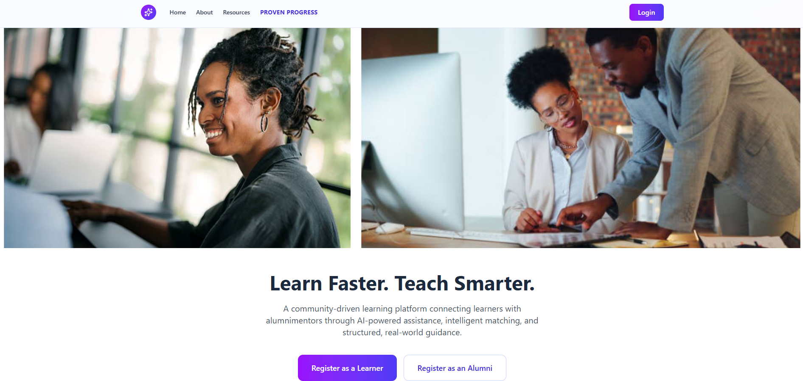
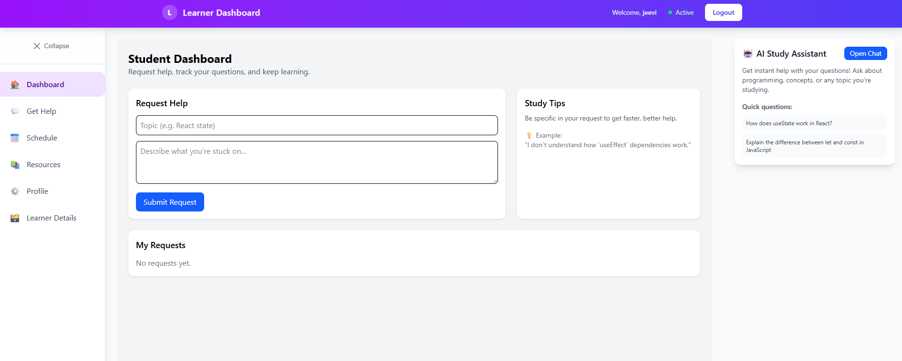
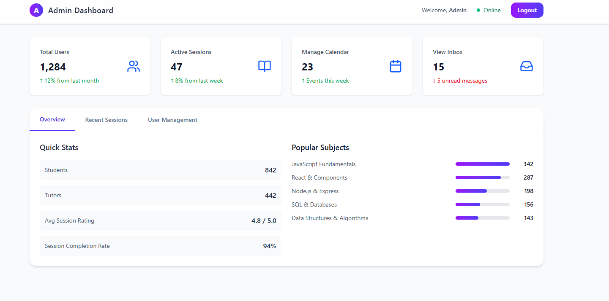

# Team 3 AI Learner Platform

## Overview

An AI-powered tutoring platform connecting learners with alumni mentors through intelligent matching and real-time support.



## 🚀 Features

- **Study Assistant** - Real-time chat support across all pages
- **Resource Sharing** - Learning materials assigned by tutors
- **Session Scheduling** - Integrated calendar system
- **Progress Tracking** - Analytics for students and tutors

## 🎯 User Roles

### 👨‍🎓 Students

- Submit help requests by topic
- Access AI study assistant
- View assigned resources
- Manage schedule and profile



### 🎓 Mentors (Tutors)

- Review mentorship requests
- Manage current students
- Assign learning resources
- Track student progress
- Schedule tutoring sessions


### 👨‍💼 Administrators

- Oversee platform users
- Monitor tutoring sessions
- Manage user registrations
- View platform analytics



## 🛠 Tech Stack

- **React + TypeScript**
- **Tailwind CSS**
- **Vite**
- **React Router**

## 🚀 Quick Start

```bash
# Clone the repo
git clone https://github.com/millan-figueroa/team3-ai-learner-platform.git

# Install dependencies
cd team3-ai-learner-platform
npm install

# Start development server
npm run dev
```

Open `http://localhost:5173` to view the app.

## 📁 Structure

```
src/
├── components/     # Reusable UI components
├── pages/         # Main application pages
├── data/          # Static data and config
└── assets/        # Images and static files
```

## 👥 Team

- **[Jeevitha Pugazhendi](https://github.com/JeevithaPugazh)**
- **[Millan Figueroa](https://github.com/millan-figueroa)**
- **[Jennifer C.G.](https://github.com/jaycruz718)**
- **[Vladislav Larionov](https://github.com/vlarionov)**

---

_Built for Per Scholas Hackathon 2025_
